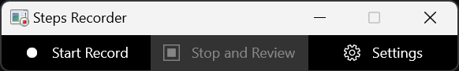

DarkTitle enforces dark window titlebars for all Win32 top-level windows. Supports MS Windows 10 & 11, including 22H2.
Sometimes content could be made dark, but titlebars aren't. (e.g. VcXsrv X server, various apps with custom theming, like qBittorrent, media players)

### Before/after running DarkTitle:
#### Windows Steps Recorder:
  
 

#### VcXsrv with cool-retro-term:
  
 

#### Python IDLE IDE:
  
 
